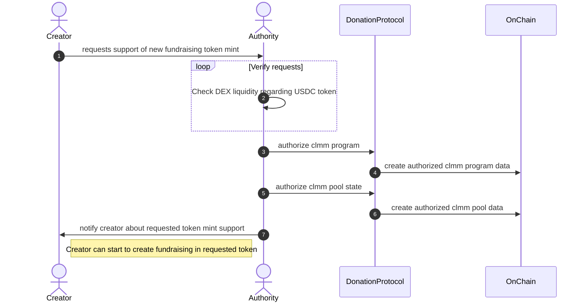
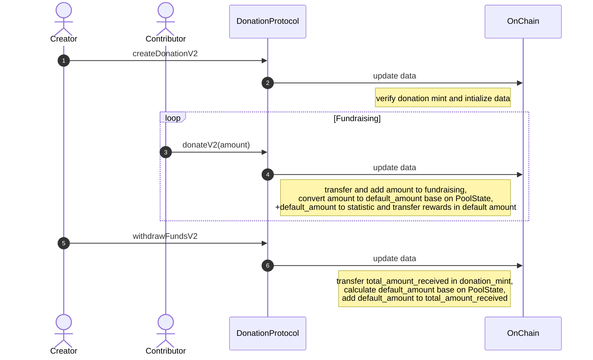

# Overview

The donation protocol implements on-chain creation of donation, contributor, creator data.
People who donate are eligible to receive token rewards.

## Protocol data design


## Create fundraising in SPL token different from defaults
Donation protocol supports default SPL token mint in which organizations can collect fundraisings.
Calculation of donors rewards, contributors and creators statistics depend on default token.
So in order to introduce different fundraising token mint we integrate v2 instructions with Raydium CLMM and sdk-v2.
Raydium CLMM `PoolState` is used to get current token pair price and calculate fair rewards and statistics.

### Authorize CLMM program and PoolState
In order to be able to create fundraising in different token then default new donation must be authorized by donation protocol authority.
New donation mints are allowed with high liquidity on DEX and have tradable pair linked with USDC token.


### Fundraising flow v2


# Environment Setup

1. Install Anchor 0.29.0 from https://www.anchor-lang.com/docs/installation

## Build and test source code

### Build programs
```
$ anchor build
```

### Test programs
1. Generate payer if it doesn't exist yet
```
$ solana-keygen new
```
2. Run the functional and integration tests. First it builds and deploys the smart contract then tests are executed locally.
```
$ anchor test
```

### Deploy Program
```
$ anchor deploy --program-name donaproto --provider.cluster devnet --provider.wallet /path_to_authority_keypair/private_key.json 
```
